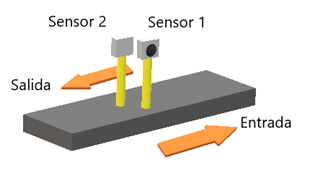
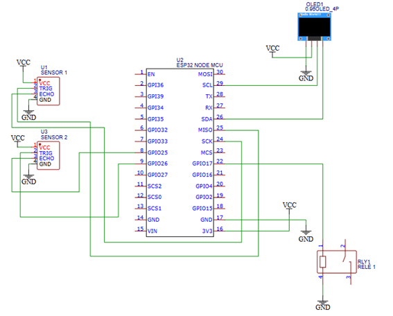
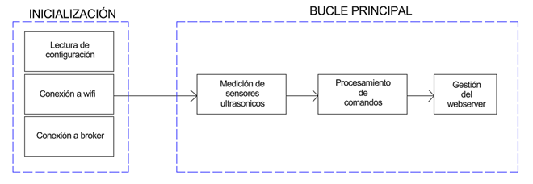
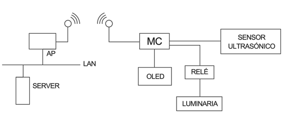

# Proyecto final - Contador de Vehículos con ESP32

## Cátedra de Electrónica II

Universidad Tecnológica Nacional - Facultad Regional Rosario\
Año: 2024\
Proyecto final

---

## Índice

1. [Introducción](#introducción)
2. [Circuito](#circuito)
3. [Requisitos del Proyecto](#requisitos-del-proyecto)
4. [Diagrama en bloques Firmware ](#diagrama-en-bloques-firmware) 
5. [Diagrama en bloques Hardware ](#diagrama-en-bloques-Hardware) 
6. [Listado de materiales](#listado-de-materiales)
7. [Logica del programa](#logica-del-programa) 
8. [Configuración MQTT y Dashboard en Node-RED](#configuracion-mqtt-y-dashboard-en-node-red)
   - [Instalación de Node-RED](#instalacion-de-node-red)
   - [Configuración del Broker MQTT](#configuracion-del-broker-mqtt)
   - [Diseño del Dashboard](#diseno-del-dashboard)
9. [Dispositivo e interfaz](#dispositivo-e-interfaz)   
10. [Estructura y funcionamiento del código](#estructura-y-funcionamiento-del-codigo)
   - [Archivos de configuración](#archivos-de-configuración)
   - [Manejo de sensores y relé](#manejo-de-sensores-y-relé)
   - [Máquina de estados](#máquina-de-estados)
   - [Comunicación](#comunicación)
   - [Persistencia](#persistencia)
   - [Interfaz y visualización](#interfaz-y-visualización)
   - [Archivos principales](#archivos-principales)
---

## Introducción
Una cochera de la ciudad de Rosario consta de una entrada y una salida.
La compañía aseguradora necesita un dispositivo capaz de contabilizar en todo momento la cantidad de vehículos que se encuentran en el interior del recinto. 

Además, se decidió que dicho dispositivo también funcione como un control de iluminación, permitiendo que cuando ingrese un vehículo automáticamente se enciendan las luces del interior.
Para tales fines se implementa un sistema para contar vehículos utilizando un ESP32, sensores ultrasónicos *HC-SR04, un *display OLED SSD1306 y un relé para controlar una luz de 220V. 

El sistema detecta el ingreso y egreso de vehículos, muestra el número actual de vehículos en un display y controla una luz que se activa según la lógica especificada. Además, envía la información del conteo vía MQTT a un servidor para su visualización en un dashboard de Node-RED.


## Circuito
En la figura se aprecia el circuito de este trabajo práctico, el led conectado al pin físico 37 de la placa de desarrollo NODE-MCU32, que corresponde al puerto 23 (GPIO23) del microcontrolador, reflejará el estado de la conexión wifi.



## Diagrama en bloques Firmware 


## Diagrama en bloques Hardware 


## Requisitos del proyecto
-	Contabilización de los vehículos en el interior mediante el sensado del ingreso y egreso de estos.
-	Activación de un relé (asociado a una lampara de 220V) durante 2 minutos, siempre que ingrese un vehículo.
-	Visualización de la cantidad de vehículos en el interior en un display oled.
-	Visualización de la cantidad de vehículos mediante un dispositivo remoto.

## Listado de materiales 
-	Microcontrolador ESP 32.
-	2 sensores ultrasónicos HC-SR04.
-	Módulo relay 2 canales optoacoplado  3.3V.
-	Display oled 0.96 128x64 I2c Arduino Ssd1306 Hobb.

## Logica del programa
Sensores ultrasónicos (HC-SR04):
•	Sensor 1: Detecta vehículos que ingresan.
•	Sensor 2: Detecta vehículos que salen.
•	Se mide la distancia y se establece un umbral para determinar cuándo un vehículo está presente.

Contador de autos:
•	Se incrementa el contador si un vehículo pasa por el sensor 1.
•	Se decrementa el contador si un vehículo pasa por el sensor 2.
•	El contador nunca baja de 0.

Relé (luz de 220V):
El relé se activa siempre que ingrese un auto durante 2 minutos, luego se desactiva. 

Display OLED:
Muestra en tiempo real el número de autos en la cochera.

---

## Configuración MQTT y Dashboard en Node-RED
Para poder visualizar la cantidad de vehículos que se encuentran en el interior de la cochera desde un dispositivo remoto, se utiliza el protocolo de comunicación MQTT, mediante el cual publicamos en el broker 'Mosquitto' y podemos ver lo publicado desde la Dashboard en Node-RED. A continuación, se explica resumidamente cómo proceder a la instalación y configuración de Node-RED:

### Instalación de Node-RED

Para instalar Node-RED, ejecutar:

bash
npm install -g node-red


Para iniciar Node-RED:

bash
node-red


### Configuración del Broker MQTT

1. Agregar un nodo mqtt in en Node-RED.
2. Configurar la conexión al broker MQTT (ejemplo: broker.hivemq.com).
3. Suscribirse al tema /contador/vehiculos.
4. Agregar un nodo mqtt out para enviar respuestas si es necesario.

### Diseño del Dashboard

1. Instalar el paquete node-red-dashboard si no está instalado.
2. Agregar un nodo gauge para visualizar la cantidad de vehículos.
3. Conectar el nodo MQTT al gauge para que actualice en tiempo real.
4. Personalizar la interfaz con etiquetas y gráficos adicionales.

## Dispositivo e interfaz

A continuación, se presentan imagenes y videos de la interfaz y del dispositivo en funcionamiento.


---
## Estructura y funcionamiento del codigo
El código está organizado en los siguientes archivos:

### Archivos de Configuración
- Config.h: Define pines de hardware, constantes de software y estructura de configuración. Como por ejemplo:
```cpp
//--Ultrasonic sensors
#define TRIG_PIN2 26  //--Exit sensor (TRIG)
#define ECHO_PIN2 25 //--Exit sensor (ECHO)
#define TRIG_PIN1 19 //--Entry sensor (TRIG)
#define ECHO_PIN1 18 //--Entry sensor (ECHO)

//--Software constants
#define SERIAL_BAUDRATE             115200

//--Structures
struct Config {
  String ssid;
  String ssid_pass;
  int max_distance;
};
```
- config_device.json: Almacena credenciales de WiFi.

### Manejo de Sensores y Relé
- sensor_handler.h/cpp: Controla los sensores ultrasónicos y detecta vehículos.

#### sensor_handler.h
```cpp 
#include <Arduino.h>

class SensorHandler {
public:
    SensorHandler(int trigPin, int echoPin);
    void begin();
    float medirDistancia();
    bool objetoDetectado(float umbral);

private:
    int _trigPin;
    int _echoPin;
};

#endif
```
##### Explicación
1. Se define la **clase SensorHandler**, encargada de manejar el sensor ultrasónico.
2. Tiene dos variables privadas _trigPin y _echoPin para almacenar los pines de conexión.
3. Se declaran tres métodos principales:
  - begin(): Configura los pines.
  - medirDistancia(): Mide y devuelve la distancia en cm.
  - objetoDetectado(umbral): Retorna true si un objeto está dentro del umbral especificado.

---

#### sensor_handler.cpp
```cpp
#include "sensor_handler.h"

SensorHandler::SensorHandler(int trigPin, int echoPin) {
    _trigPin = trigPin;
    _echoPin = echoPin;
}
```
##### Explicación
- Constructor de la clase que inicializa los pines del sensor.

---

```cpp
void SensorHandler::begin() {
    pinMode(_trigPin, OUTPUT);
    pinMode(_echoPin, INPUT);
}
```
##### Explicación
- Configura trigPin como salida y echoPin como entrada.

---
```cpp
float SensorHandler::medirDistancia() {
    digitalWrite(_trigPin, LOW);
    delayMicroseconds(2);
    digitalWrite(_trigPin, HIGH);
    delayMicroseconds(10);
    digitalWrite(_trigPin, LOW);

    long duracion = pulseIn(_echoPin, HIGH);
    float distancia = duracion * 0.034 / 2;
    
    return distancia;
}
```
##### Explicación
1. Envía un pulso ultrasónico de *10µs* y mide el tiempo de eco.
2. Calcula la distancia en cm utilizando la fórmula:
  
  distancia = (duracion * 0.034) / 2
---

```cpp
bool SensorHandler::objetoDetectado(float umbral) {
    return medirDistancia() <= umbral;
}
```
##### Explicación
- Verifica si la distancia medida es menor o igual al umbral, indicando la presencia de un objeto.
---

- relay_manager.h/cpp: Maneja la activación del relé para la luz.

#### relay_manager.h
```cpp
#include <Arduino.h>

class RelayManager {
public:
    RelayManager(int pin); // Constructor
    void begin(); // Initialize the relay
    void turnOn(); // Activate the relay
    void turnOff(); // Deactivate the relay
    bool isOn(); // Check if relay is active

private:
    int relayPin; // Pin where the relay is connected
    bool state; // Stores the relay state
};

#endif
```

#### relay_manager.cpp
```cpp
#include "relay_manager.h"

// Constructor: initializes the relay pin and sets initial state to OFF
RelayManager::RelayManager(int pin) : relayPin(pin), state(false) {}

// Sets the relay pin as an output and ensures it starts OFF
void RelayManager::begin() {
    pinMode(relayPin, OUTPUT);
    digitalWrite(relayPin, LOW); // Ensure relay starts turned off
}

// Turns the relay ON
void RelayManager::turnOn() {
    digitalWrite(relayPin, HIGH);
    state = true;
}

// Turns the relay OFF
void RelayManager::turnOff() {
    digitalWrite(relayPin, LOW);
    state = false;
}

// Returns whether the relay is currently ON
bool RelayManager::isOn() {
    return state;
}
```
##### Funcionamiento
1. Se crea una instancia de RelayManager pasando el número de pin del relé.
2. Se llama a begin() para configurar el pin como salida y apagar el relé inicialmente.
3. turnOn() y turnOff() permiten encender o apagar el relé según sea necesario.
4. isOn() devuelve el estado actual del relé.


### Máquina de Estados
- FSM_sensor_manager.h/cpp: Implementa la lógica del sistema con una máquina de estados finitos (FSM) para gestionar detecciones y el control del relé. Sus funciones principales son:
1. Administra los diferentes estados del sensor ultrasónico.
2. Controla la activación y desactivación del relé en función de las detecciones.
3. Implementa transiciones de estado según la lógica de detección.
4. Optimiza el rendimiento evitando activaciones innecesarias del relé.

#### FSM_sensor_manager.h:
##### Definición de estados
```cpp
// Enum for the different states of the FSM
enum SystemState { IDLE, CHECK_ENTRY, CHECK_EXIT, UPDATE_DISPLAY, RELAY_CONTROL };
``` 
Se define una enumeración que representa los diferentes estados del sistema.

#### FSM_sensor_manager.cpp:
##### Máquina de estados
```cpp
// Function to update the FSM state based on sensor readings
void FSM_sensor_run() {
    unsigned long currentMillis = millis();
    static unsigned long lastStateChange = 0;

    switch (currentState) {
        case IDLE:
            if (currentMillis - lastStateChange >= interval) {
                currentState = CHECK_ENTRY;
                lastStateChange = currentMillis;
            }
            break;

        case CHECK_ENTRY:
            if (checkVehicle(TRIG_PIN1, ECHO_PIN1, VEHICLE_ENTRY)) {
                processEntry();
            }
            currentState = CHECK_EXIT;
            break;

        case CHECK_EXIT:
            if (checkVehicle(TRIG_PIN2, ECHO_PIN2, VEHICLE_EXIT)) {
                processExit();
            }
            currentState = UPDATE_DISPLAY;
            break;

        case UPDATE_DISPLAY:
            updateDisplay(vehicle_count);
            currentState = RELAY_CONTROL;
            break;

        case RELAY_CONTROL:
            if (relay_active && (millis() - relay_timer_start >= RELAY_DURATION)) {
                digitalWrite(RELAY_PIN, LOW);
                relay_active = false;
                Serial.println("Relay turned off after 2 minutes");
            }
            currentState = IDLE;
            break;
    }
}
```
Aquí se manejan las transiciones entre los diferentes estados de la máquina de estados finitos. La activación y desactivación del relé se realiza en función de la distancia detectada.

### Comunicación
- wifi_manager.h/cpp: Gestiona la conexión WiFi.

#### wifi_manager.h
Este archivo define las funciones que se implementan en wifi_manager.cpp. Su propósito es declarar los métodos relacionados con la gestión del WiFi.
```cpp
//--Includes
#include "persist.h"
#include "config.h"
#include "functions.h"
#include <WiFi.h>

void initWiFi();
bool isWiFiConnected();
void handleWiFiConnection();

#endif 
```

1. initWiFi(); → Inicializa la conexión WiFi con las credenciales almacenadas.
2. isWiFiConnected(); → Verifica si el dispositivo está conectado a WiFi.
3. handleWiFiConnection(); → Revisa la conexión y, si está desconectado, intenta reconectar.

#### wifi_manager.cpp
```cpp
void initWiFi() {
    WiFi.begin(config.ssid.c_str(), config.ssid_pass.c_str()); // Start WiFi connection with stored credentials

    unsigned long startAttemptTime = millis(); // Record the start time of the connection attempt

    // Try to connect within the defined timeout
    while (WiFi.status() != WL_CONNECTED && millis() - startAttemptTime < WIFI_TIMEOUT) {
        delay(1000);
        Serial.println("Connecting to WiFi..."); // Print connection attempt message
    }

    // Check if the connection was successful
    if (WiFi.status() == WL_CONNECTED) {
        Serial.println("WiFi connected."); // Confirm connection
        Serial.print("IP Address: ");
        Serial.println(WiFi.localIP()); // Display the assigned IP address
    } else {
        Serial.println("Failed to connect to WiFi."); // Notify if connection attempt failed
    }
}
```
1. Usa WiFi.begin(config.ssid.c_str(), config.ssid_pass.c_str()); para iniciar la conexión con la red WiFi
2. Espera hasta WIFI_TIMEOUT (20 segundos) para conectarse.
3. Si se conecta correctamente, imprime la IP asignada.
4. Si falla, muestra un mensaje de error.
```cpp
bool isWiFiConnected() {
    return WiFi.status() == WL_CONNECTED;
}
```
Devuelve true si el WiFi está conectado (WiFi.status() == WL_CONNECTED).
```cpp
void handleWiFiConnection() {
    if (!isWiFiConnected()) { // If WiFi is not connected
        Serial.println("WiFi disconnected. Attempting to reconnect...");
        initWiFi(); // Attempt to reconnect
    }
}
```
Si el WiFi se desconectó, intenta reconectarse llamando a initWiFi(). 

- mqtt_manager.h/cpp: Configura la conexión con el broker MQTT y maneja los mensajes.

#### mqtt_manager.h:
Define las funciones y variables necesarias para la gestión de MQTT.
```cpp
//--Includes
#include <Arduino.h>
#include <PubSubClient.h>
#include <WiFi.h>

extern WiFiClient espClient;
extern PubSubClient mqttClient;

void setupMQTT();
void reconnectMQTT();
void mqttCallback(char* topic, byte* payload, unsigned int length);
void handleMQTTConnection();

#endif
``` 
1. setupMQTT(): Configura el cliente MQTT con el servidor y la función de callback.
2. reconnectMQTT(): Se encarga de reconectar si la conexión MQTT se pierde.
3. mqttCallback(char* topic, byte* payload, unsigned int length): Función que se ejecuta cuando llega un mensaje MQTT.
4. handleMQTTConnection(): Mantiene la conexión y procesa los mensajes recibidos.

#### mqtt_manager.cpp:
```cpp
// Initial configuration for MQTT connection

#define MQTT_SERVER "192.168.0.193"     // MQTT broker IP address
#define MQTT_PORT 1883                  // MQTT broker port
#define MQTT_USER "proyectoelectronicaII" // MQTT username
#define MQTT_PASSWORD "proyectoelectronicaII" // MQTT password

// Create a WiFi client instance for MQTT communication
WiFiClient espClient;
PubSubClient mqttClient(espClient);

// Variables to store received MQTT topics and messages
String topic_rpc_req;
String msg_rpc_req;
```
1. Se define la IP del broker MQTT (192.168.0.193) y el puerto (1883).
2. Se configuran el usuario y contraseña del broker.
3. Se crean las variables topic_rpc_req y msg_rpc_req para almacenar el tema y el mensaje recibido.

```cpp
void setupMQTT() {
    mqttClient.setServer(MQTT_SERVER, MQTT_PORT); // Set MQTT broker address and port
    mqttClient.setCallback(mqttCallback); // Set the callback function to handle received messages
}
```
1. Configura el servidor MQTT con mqttClient.setServer().
2. Establece la función de callback (mqttCallback) que se ejecutará cuando se reciba un mensaje.

```cpp
void reconnectMQTT() {
    while (!mqttClient.connected()) { // Check if the client is not connected
        Serial.println("Try to connect to MQTT server"); // Print connection attempt message
        
        // Attempt to connect to the MQTT broker using the provided credentials
        if (mqttClient.connect("proyectoelectronicaII", MQTT_USER, MQTT_PASSWORD)) {
            Serial.println("Connected to MQTT server!"); // Print success message
            
            // Subscribe to the topic to receive commands from the broker
            mqttClient.subscribe("proyectoelectronicaII/commands"); 
        } else {
            delay(5000); // Wait before retrying the connection
        }
    }
}
```
1. Si el cliente no está conectado, intenta reconectar al servidor MQTT.
2. Cuando logra la conexión, se suscribe al topic "proyectoelectronicaII/commands".
3. Si falla, espera 5 segundos antes de reintentar.

```cpp
void mqttCallback(char* topic, byte* payload, unsigned int length) {
    payload[length] = '\0'; // Ensure the payload is null-terminated

    // Store the received topic and message as strings
    topic_rpc_req = String((char*)topic);
    msg_rpc_req = String((char*)payload);

    // Debug messages to print received data
    Serial.print("[DEBUG RPC] Topic received: "); Serial.println(topic_rpc_req);
    Serial.print("[DEBUG RPC] Message received: "); Serial.println(msg_rpc_req);
```
1. Se ejecuta cuando el ESP32 recibe un mensaje MQTT.
2. Guarda el topic y el mensaje en variables.
3. Imprime los datos recibidos en el Monitor Serie para depuración.    

```cpp
void handleMQTTConnection() {
    if (!mqttClient.connected()) { // Check if MQTT connection is active
        reconnectMQTT(); // Attempt to reconnect if disconnected
    }
    mqttClient.loop(); // Process incoming messages and maintain connection
}
```
1. Si el cliente MQTT está desconectado, intenta reconectarlo.
2. Llama a mqttClient.loop(); para procesar los mensajes entrantes.

- publish_manager.h/cpp: Publica el conteo de vehículos al broker MQTT.

#### publish.h
```cpp
// Define the possible states of the FSM
enum SensorState {
    IDLE,       // No vehicle detected
    VEHICLE_IN, // Vehicle entering
    VEHICLE_OUT // Vehicle exiting
};
```
Este archivo define un enumerador (enum) llamado SensorState, que representa los posibles estados de la máquina de estados finita (FSM) para detectar vehículos. Los estados son:
1. IDLE: No se detecta ningún vehículo.
2. VEHICLE_IN: Se detecta la entrada de un vehículo.
3. VEHICLE_OUT: Se detecta la salida de un vehículo.

#### publish.cpp
Este archivo implementa la función publishvehicle_count(int vehicle_count), la cual publica la cantidad de vehículos detectados en un broker MQTT.
```cpp
// Function to publish the vehicle count to the MQTT broker
void publishvehicle_count(int vehicle_count) {
    // Convert the integer vehicle count to a string
    String payload = String(vehicle_count);

    // Publish the payload to the specified MQTT topic
    if (mqttClient.publish("proyectoelectronicaII/vehicleCount", payload.c_str())) {
        Serial.println("Publish successful"); // Confirm successful publishing
    } else {
        Serial.println("Publish not successful"); // Notify if publishing fails
    }
}
```
1. Convierte el número de vehículos (int vehicle_count) a una cadena (String)
2. Publica el mensaje en el tema MQTT "proyectoelectronicaII/vehicleCount"
3. Muestra en el monitor serie si la publicación fue exitosa o no. Si el envío es exitoso, imprime "Publish successful". Si falla, imprime "Publish not successful".

- persist_manager.h/cpp: Guarda y carga configuraciones desde la memoria persistente.

### Persistencia
- persist_manager.h/cpp: Guarda y carga configuraciones desde la memoria persistente.

#### persist.h
1. Inclusión de librerías necesarias:
```cpp
#include <Preferences.h>
#include "config.h"
#include "functions.h"

- Preferences.h: Manejo del almacenamiento persistente en el ESP32.
- config.h: Probablemente contiene la estructura Config, donde se almacenan los valores de configuración.
- functions.h: No está definido aquí, pero puede contener funciones auxiliares.
```
2. Definición de valores predeterminados:
```cpp
#define DEFAULT_WIFI_SSID       "Fibertel598 2.4GHz"
#define DEFAULT_WIFI_PASSWORD   "00421413349"
#define DEFAULT_MAX_DISTANCE 20
```
Si no hay valores guardados en la memoria persistente, se usarán estos valores por defecto.
3. Declaración de funciones:
```cpp
void save_config(uint8_t name);
void load_config(void);
```
#### persist.cpp
```cpp
void save_config(uint8_t name) {
    switch(name) {
        case DEVICE_CONFIG:
            persist.begin("config"); // Open the storage area
            persist.putString("ssid", config.ssid); // Store WiFi SSID
            persist.putString("ssid_pass", config.ssid_pass); // Store WiFi password
            persist.putInt("max_distance", config.max_distance); // Store max distance setting
            persist.end(); // Close the storage area
            break;
        case IRR_CONFIG:
            persist.begin("config"); // Open the storage area
            persist.end(); // Close the storage area without changes
    }

    // Print stored configuration values for verification
    Serial.println("Config saved:");
    Serial.println(config.ssid);
    Serial.println(config.ssid_pass);
    Serial.println(config.max_distance);
}
```
Esta función guarda la configuración en la memoria flash del ESP32 usando la biblioteca Preferences.
1. Recibe un parámetro name, que indica qué tipo de configuración se quiere guardar.
2. Usa un switch para elegir qué configuración guardar:
- Si name == DEVICE_CONFIG, guarda: config.ssid (nombre de la red WiFi), config.ssid_pass (contraseña de la red WiFi) y config.max_distance (distancia máxima permitida).
- Si name == IRR_CONFIG, simplemente abre y cierra el almacenamiento sin guardar nada.
3. Usa persist.begin("config") para abrir la memoria flash en la sección "config".
4. Usa persist.putString y persist.putInt para almacenar los valores en la memoria persistente.
5. Cierra la memoria flash con persist.end() para evitar posibles pérdidas de datos o corrupciones.
6. Imprime los valores guardados en el monitor serie para verificar que la operación fue exitosa.

```cpp
void load_config(void) {
    // Open the storage area
    persist.begin("config");

    // Retrieve stored values, using defaults if they are not found
    config.ssid = persist.getString("ssid", DEFAULT_WIFI_SSID);
    config.ssid_pass = persist.getString("ssid_pass", DEFAULT_WIFI_PASSWORD);
    config.max_distance = persist.getInt("max_distance", DEFAULT_MAX_DISTANCE);

    // Close the storage area
    persist.end();

    // Print loaded configuration values for verification
    Serial.println("Config read:");
    Serial.print("SSID: ");
    Serial.println(config.ssid);
    Serial.print("SSID Password: ");
    Serial.println(config.ssid_pass);
    Serial.print("Max Distance: ");
    Serial.println(config.max_distance);
}
```
Esta función carga los valores almacenados en la memoria flash del ESP32. Si no hay valores guardados, usa los valores por defecto.
1. Abre la memoria persistente con persist.begin("config").
2. Recupera los valores almacenados con persist.getString y persist.getInt:
- persist.getString("ssid", DEFAULT_WIFI_SSID): Si el SSID está guardado, lo carga. Si no, usa DEFAULT_WIFI_SSID.
- persist.getString("ssid_pass", DEFAULT_WIFI_PASSWORD): Recupera la contraseña o usa el valor por defecto.
- persist.getInt("max_distance", DEFAULT_MAX_DISTANCE): Recupera la distancia máxima almacenada o usa DEFAULT_MAX_DISTANCE.
3. Cierra la memoria flash con persist.end() para liberar el recurso.
4. Imprime los valores recuperados para verificar que la configuración se cargó correctamente.

### Interfaz y Visualización
- display_manager.h/cpp: Inicializa y actualiza la pantalla OLED con el conteo de vehículos.
#### display_manager.h
```cpp
#include <U8g2lib.h>
#include <Wire.h>
#include "config.h"
```
1. Inclusión de librerías necesarias:
- U8g2lib.h: Librería para manejar pantallas OLED basadas en controladores como el SSD1306.
- Wire.h: Librería para comunicación I2C con la pantalla OLED.
- config.h: Archivo que probablemente contiene configuraciones generales del sistema.

```cpp
void initDisplay();
void updateDisplay(int vehicleCount);
```
2. Declaración de funciones:
- initDisplay(): Inicializa la pantalla OLED y muestra un mensaje de inicio.
- updateDisplay(int vehicleCount): Muestra la cantidad de autos en la cochera.

#### display_manager.cpp
```cpp
U8G2_SSD1306_128X64_NONAME_F_HW_I2C u8g2(U8G2_R0, /* reset=*/ U8X8_PIN_NONE);
```
Crea una instancia de la librería U8g2 para manejar la pantalla OLED SSD1306 en modo I2C.

```cpp
void initDisplay() {
    u8g2.begin(); //--Initialize the display
    u8g2.clearBuffer(); //--Clear the buffer
    u8g2.setFont(u8g2_font_t0_11b_tf); //--Set the font
    u8g2.drawStr(22, 20, "Sistema iniciado"); //--Initial message
    u8g2.sendBuffer(); //--Send the buffer to the display
    delay(2000); //--Pause to visualize
    u8g2.clearBuffer();
}
```
1. u8g2.begin(): Inicializa la pantalla OLED.
2. u8g2.clearBuffer(): Borra cualquier contenido previo en el buffer de la pantalla.
3. u8g2.setFont(u8g2_font_t0_11b_tf): Configura la fuente de texto.
4. u8g2.drawStr(22, 20, "Sistema iniciado"): Muestra el texto "Sistema iniciado" en la posición (22,20).
5. u8g2.sendBuffer(): Envía los datos al display para que se actualice la pantalla.
6. delay(2000): Pausa de 2 segundos para que el mensaje se pueda leer.
7. u8g2.clearBuffer(): Borra el mensaje para preparar la pantalla para futuros usos.

```cpp
void updateDisplay(int vehicleCount) {
    u8g2.clearBuffer(); //--Clear the previous content
    u8g2.setFont(u8g2_font_t0_11b_tf); //--Set the font

    //--Write text in the screen
    u8g2.drawStr(18, 15, "Autos en cochera:");
    u8g2.setCursor(60, 40);
    u8g2.print(vehicleCount); //--Display number of cars

    u8g2.sendBuffer(); //--Update screen
}
```
1. u8g2.clearBuffer(): Borra el contenido previo del buffer de la pantalla.
2. u8g2.setFont(u8g2_font_t0_11b_tf): Configura la fuente de texto.
3. u8g2.drawStr(18, 15, "Autos en cochera:"): Escribe "Autos en cochera:" en la posición (18,15).
4. u8g2.setCursor(60, 40): Posiciona el cursor en (60,40) para escribir el número de autos.
5. u8g2.print(vehicleCount): Muestra el número de autos en pantalla.
6. u8g2.sendBuffer(): Envía los datos al display para actualizar la pantalla.

### Archivos Principales
- main.cpp: Inicializa los módulos y ejecuta el bucle principal.
#### main.cpp
```cpp
#include <Arduino.h>
#include "sensor_handler.h"
#include "config.h"
#include "wifi_manager.h"
#include "display_manager.h"
#include "FSM_sensor_manager.h"
#include "wifi_manager.h"
#include "relay_manager.h"
#include "mqtt.h"
#include "publish.h"
```
1. Inclusión de librerías y módulos.

```cpp
Config config;
```
2. Creación de la estructura Config: Declara una variable config que almacenará la configuración del sistema. Esta variable almacena datos como el SSID del WiFi, contraseña, distancia máxima, etc.

```cpp
void setup() {
    Serial.begin(SERIAL_BAUDRATE);

    load_config();

    //--Initialize ultrasonic sensors
    initSensors();

    //--Initialize OLED Display
    initDisplay();

    //--initialize relay
    initrelay();

    //--Initialize WiFi
    initWiFi();

    //--Initialize mqtt protocol
    setupMQTT();

}
```
3. Inicialización del sistema:
- Serial.begin(SERIAL_BAUDRATE): Inicia la comunicación serial para depuración.
- load_config(): Carga la configuración almacenada en la memoria persistente.
- initSensors(): Inicializa los sensores ultrasónicos.
- initDisplay(): Inicializa la pantalla OLED.
- initrelay(): Inicializa el relé que controla la luz de 220V.
- initWiFi(): Conecta el ESP32 a la red WiFi.
- setupMQTT(): Configura la comunicación con el servidor MQTT.

```cpp
unsigned long lastStateChange = 0;
```
4. Se declara una variable para almacenar el último cambio de estado de la máquina de estados finita (FSM).
Esta variable se usa para controlar tiempos o evitar cambios de estado demasiado rápidos.

```cpp
void loop() {

    //--Ensure WiFi stays connected
    handleWiFiConnection();

    //--Ensure MQTT stays connected
    handleMQTTConnection();
    
    //--Run the FSM
    FSM_sensor_run();
}
```
5. Este bloque se ejecuta en un bucle infinito y mantiene el sistema en funcionamiento:
- handleWiFiConnection(); → Verifica si el ESP32 sigue conectado a WiFi y lo reconecta si es necesario.
- handleMQTTConnection(); → Mantiene la conexión con el servidor MQTT activa.
- FSM_sensor_run(); → Ejecuta la máquina de estados finita para gestionar los sensores y detectar entradas/salidas de autos.

- functions.h/cpp: Maneja configuraciones y lectura de datos JSON.
#### functions.h
```cpp
#include <Arduino.h>
#include <ArduinoJson.h>
#include "config.h"
#include "persist.h"
```
1. Inclusión de librerías y archivos necesarios:
- Arduino.h: Librería base para Arduino.
- ArduinoJson.h: Permite manipular datos en formato JSON.
- config.h: Contiene la estructura de configuración del sistema.
- persist.h: Maneja la memoria persistente para guardar configuraciones.

```cpp
#define TIMEOUT_SERIAL_CONFIG   10000
#define DEVICE_CONFIG           1
#define IRR_CONFIG              2
```
2. Definición de macros:
- TIMEOUT_SERIAL_CONFIG (10000 ms): Define un tiempo de espera máximo de 10 segundos para recibir la configuración JSON por Serial.
- DEVICE_CONFIG: Indica que se está modificando la configuración del dispositivo (WiFi, por ejemplo).
- IRR_CONFIG: Parece estar reservado para otro tipo de configuración (aunque en este código no se usa).

```cpp
void conf_read(void);
```
3. Declara la función conf_read(), que se encargará de leer la configuración desde Serial y almacenarla.

#### functions.cpp
```cpp
extern Config config;
```
1. Se declara config como extern, lo que significa que la variable está definida en otro archivo (config.h), pero puede ser utilizada aquí.

```cpp
void conf_read(void) {
    // Create a JSON document to store the parsed data
    ArduinoJson::StaticJsonDocument<1024> parse_comm;
    const char *ssid;
    const char *ssid_pass;
    uint32_t st;

    Serial.println(F("Put json config file...")); // Prompt message to indicate waiting for JSON input
    st = millis(); // Store the current time for timeout handling

    // Wait for incoming JSON data over Serial within a defined timeout
    while (millis() - st < TIMEOUT_SERIAL_CONFIG) {
        if (Serial.available() > 0) { // Check if there is data available on Serial
            String comm = Serial.readStringUntil('\n'); // Read the incoming JSON string until a newline character
            Serial.println(comm); // Print the received JSON string

            // Attempt to parse the JSON string
            DeserializationError error = deserializeJson(parse_comm, comm);
            if (error) {
                Serial.print(F("Fail to parse Json file. ")); // Print error message if parsing fails
                Serial.println(error.f_str()); // Print the specific error
                break; // Exit loop if JSON parsing fails
            }

            // Check if the JSON contains the expected "device" key
            if (parse_comm.containsKey("device")) {
                ssid = parse_comm["device"]["ssid"]; // Extract SSID
                ssid_pass = parse_comm["device"]["ssid_pass"]; // Extract SSID password

                // Store the extracted values in the global configuration object
                config.ssid = ssid;
                config.ssid_pass = ssid_pass;

                // Save the updated configuration to a file or persistent storage
                save_config(DEVICE_CONFIG);
            }

            Serial.println(F("Configuration changed!")); // Confirm configuration update
            return; // Exit the function after processing the JSON data
        }

        delay(100); // Small delay to prevent excessive CPU usage
    }

    Serial.println(F("No json received. No changes.")); // Print message if no valid JSON is received within timeout
}
```
2. Esta función espera recibir un JSON por Serial, lo analiza y guarda la configuración. A continuación se explica paso a a paso:
- Creación del objeto JSON y variables auxiliares.
- Se imprime un mensaje por Serial indicando que se espera un archivo JSON y se guarda el tiempo inicial.
- Esperar datos JSON desde Serial: Este while espera hasta 10 segundos (TIMEOUT_SERIAL_CONFIG) para recibir datos; si hay datos en el puerto Serial, se procede a leerlos. Se lee la línea completa (hasta un salto de línea) y se imprime en el monitor Serial.
- Se intenta convertir la cadena comm en un objeto JSON. Si hay un error en el JSON recibido, se muestra un mensaje y se sale del bucle.
- Se verifica si el JSON contiene la clave "device". Si la clave "device" está presente, se extraen los valores SSID y contraseña y se los guarda en la variable config.
- Se llama a save_config(DEVICE_CONFIG) para guardar los nuevos valores en la memoria persistente.
- Se imprime un mensaje de confirmación y se sale de la función.
- Se espera 100 ms en cada iteración para no saturar el procesador. Si el while termina sin recibir un JSON válido, se imprime un mensaje indicando que no hubo cambios.
